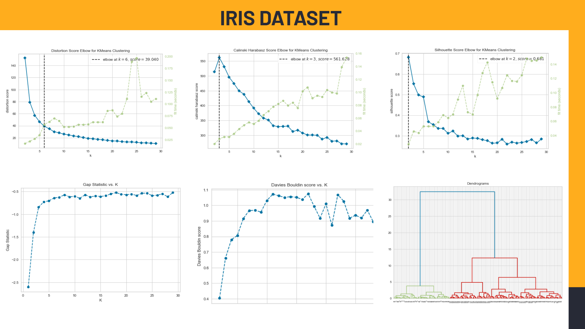
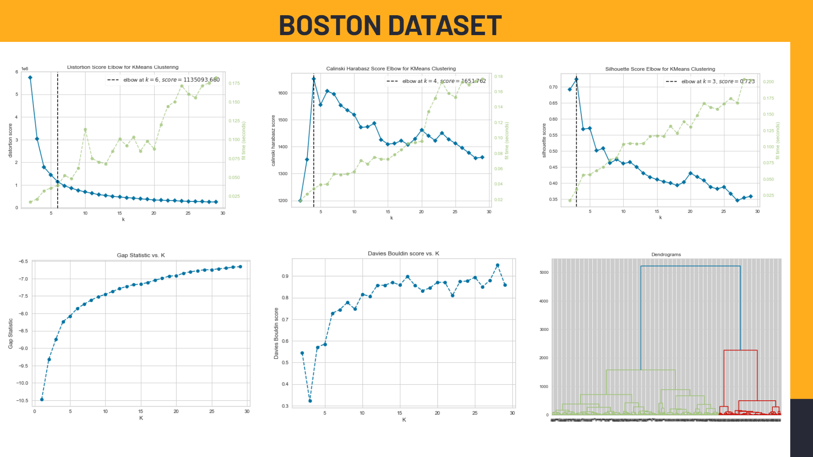
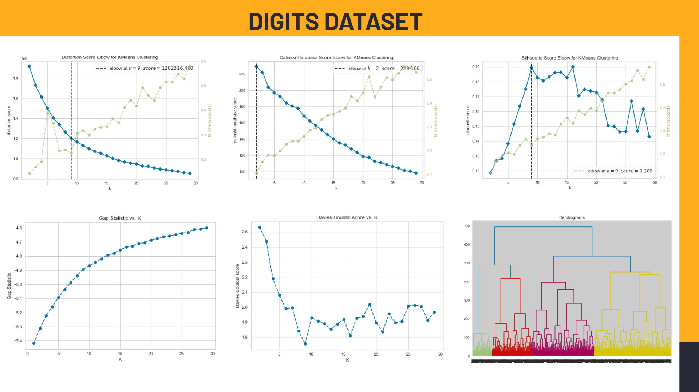
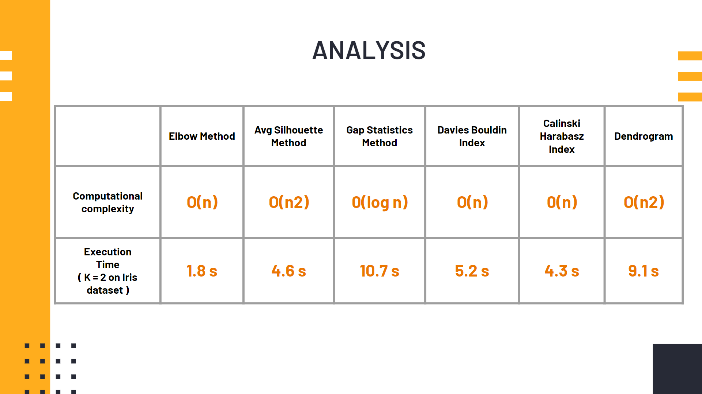

# Optimal_number_of_clusters

Performance comparison of various techniques for determining the optimal number of clusters in a data set .

We have used 6 clustering methods:

1.Elbow Method

2.Average Silhouette Method

3.Gap Statistics Method

4.Davies-Bouldin Index

5.Calinski-Harabasz Index

6.Dendrogram

The above techniques have been tested over open source available datasets imported using sklearn library which are:
Datasets used:

1.Boston

2.Iris

3.Digits

<h2>Elbow Method</h2>

It calculates the Within-Cluster-Sum of Squared Errors (WSS) for different values of k, choose the k for which WSS first starts to diminish. 

 <h4>Optimal Clusters</h4> - Cluster K after which there is negligible changes to the clustering.

<h2>Average Silhouette Method</h2>

The silhouette value measures how similar a point is to its own cluster (cohesion) compared to other clusters (separation). 

<h4>Optimal Clusters</h4> - Cluster K with the highest peak (average silhouette score)

<h2>Gap Statistics Method</h2>

Compares the total within intra-cluster variation [wss] for different values of k with their expected values under null reference distribution of the data.
The estimate of the optimal clusters will be value that maximize the gap statistic.

<h4>Optimal Clusters</h4> - Cluster K with the max gap statistic

<h2>Davies-Bouldin Index</h2>

Evaluates intra-cluster similarity and inter-cluster differences.
If two clusters are close together but have a large spread then this ratio will
be large, indicating that these clusters are not very distinct.

<h4>Optimal Clusters</h4> - Cluster K with the least DBI

<h2>Calinski-Harabasz Index</h2>

The index is calculated by dividing the variance of the sums of squares of the distances of individual objects to their cluster center by the sum of squares of the distance between the cluster centers.

<h4>Optimal Clusters</h4> - Cluster K with the highest CHI

<h2>Dendrogram</h2>

It considers each point as a separate cluster and starts joining points to clusters in a hierarchical fashion based on their distances.
If two clusters are merged, the dendrogram will join them in a graph and the height of the join will be the distance between those clusters.

<h4>Optimal Clusters</h4> - Hierarchical structure of the dendrogram

<h1>Observed Results<h1>
 
<h2>Iris Dataset<h2>

  
<h2>Boston Dataset<h2>

  
<h2>Digits Dataset<h2>

<h1>Result<h1>
 

 
